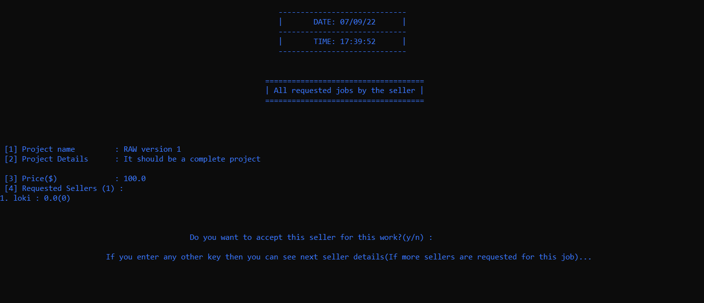
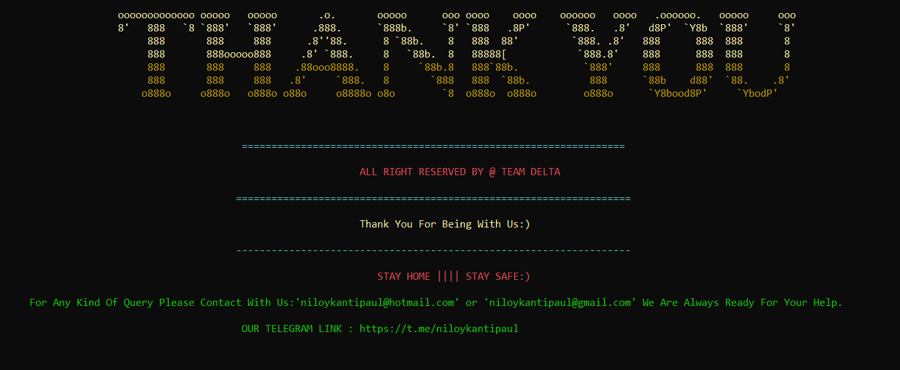

# RAW (Remotely Assistant Worker)

| WELCOME TO RAW |

----------------
| Introduction |
----------------

RAW is a pure Java based program which will work as like a freelancing website. Remotely Assistant Worker or RAW was built with pure Java and console based. But it is not a complete project. This is the 1st version we released of RAW. In the long run the update of RAW can be visible.

Thank you everyone.

>> YouTube video link: https://youtu.be/aObzrlNLhI0

-------------------
| Required System |
-------------------

 >> Any version of windows operating system.
 
 >> Notepad++
 
 >> Java should be installed. Make sure your JDK version is: jdk-18.0.2.1
 
 >> Microsoft SQL Server Management Studio 2014 or above.

--------------------------
| Minimum Specifications |
--------------------------

    1. Operating System : Windows® 7/8/10/11
    2. Processor	: Intel® Core™ i3
    3. Memory		: 1 GB RAM
    4. Graphics		: Not Required
    5. Network		: Broadband Internet Connection
    6. Storage		: 500 MB

--------------
| How to run |
--------------

 >> First open "start.java" on Notepad++.
 
 >> Type cmd from your file location path.
 
 >> Type "javac start.java" on command prompt. Press enter.
 
 >> Then type "java start" on command prompt.
 
 >> Again press enter.

--------------------
| How to use "RAW" |
--------------------

	 1. NOTE: PLEASE ENSURE THAT YOUR CONSOLE BOX IS FULL SCREEN AND FONT SIZE '19' WITH FONT STYLE 'CONSOLAS'.
	 2. RAW is designed with 3 types of users. Admin, Buyer and Seller.
	 3. To get access to the authority access, you need to enter authority password: passwordadmin
	 4. Some requirement for user password:
		1 Capital word.
		1 Small word.
		1 Number.
		1 Special character.
		Password length must be 8 to 16.
	 5. Some requirement for user Gmail: Must use a valid gmail address.
	 6. Ypu can't create same type(seller, buyer) of account with a same mail.
	 7. In every cases, user Name must be unique. You can not use a name that already have used before.

   Admin :
   
	   1. After every transaction between Seller and Buyer, admin will get a 10% cutoff. Authority Access is to track the record.

   Buyer :
   
	   1. A buyer can view his/her profile.
	   2. Search any seller.
	   3. Add any job.
	   4. View seller job requests, accept and reject any seller.
	   5. View all project in detail.
	   6. View submitted task.
	   7. Buyer can rate a Seller 
 
   Seller :
   
	   1. A seller can view his/her profile.
	   2. Search any buyer.
	   3. Search a job and send request for it.
	   4. Can view the jobs he/she has beated for.
	   5. Submit any job with a link.
	   6. Seller can rate a Buyer as well.

---------------------------
| Background Informations |
---------------------------

At present time unemployment problem is a big problem. The recent world is very digitalized and commercial. In that commercial world to find a better rhythm between the carrier and life goals most of the people want to be a freelancer. Besides this, it will help to attend a healthier work-life balance. Moreover, there will be no limitation of works. If you want to make some extra income freelancing is a good choice.

With a view to make a marketplace for the people, we have introduced the RAW.

----------------------------
| Developer's Informations |
----------------------------

	 1. Niloy Kanti Paul
		Email		: niloykantipaul@gmail.com
		LinkedIn	: https://www.linkedin.com/in/niloy-kanti-paul-5543181ab/
		Github		: https://github.com/DEV-NKP

	 2. Kaushik Biswas
		Email		: biswaskaushik.2020@gmail.com
		LinkedIn	: https://www.linkedin.com/in/kaushik-biswas-2b6554243/
		Github		: https://github.com/Kaushik-Biswas

		
----------------------
| Project Highlights |
----------------------

> This is the landing page for RAW.

> We have a feature of real date and time in RAW.

> Here is the main menu of the RAW.

> Authority password is needed to get authority access.

> An authority password is needed to get access to the admin account.

> Both seller and buyer needs to signup to the system at first.

> Login first to get access to the dashboard.

> These are the options which are available for the buyer.

> Both Buyer and Seller can see their profiles.

> A buyer can post a job.

> After posting a job, buyer can see the posted jobs.

> A buyer can have a look on who have requested for the job.

> After submission of a job from a seller, the post status will be changed to "Completed" from "Active" or "Pending".

> Buyer can accept the seller's submitted job and can rate them out of 5.

> Both seller and buyer search for each others profile.

> Seller need to fill up a form with valid informations to submit the job.

> These are the options which are available for the seller.

> A seller can search a job with the skill and send request for that job.

> Exit is more attractive with RAW.

********************************************ⒸAll Rights Reserved By "TEAM_RAW"********************************************

